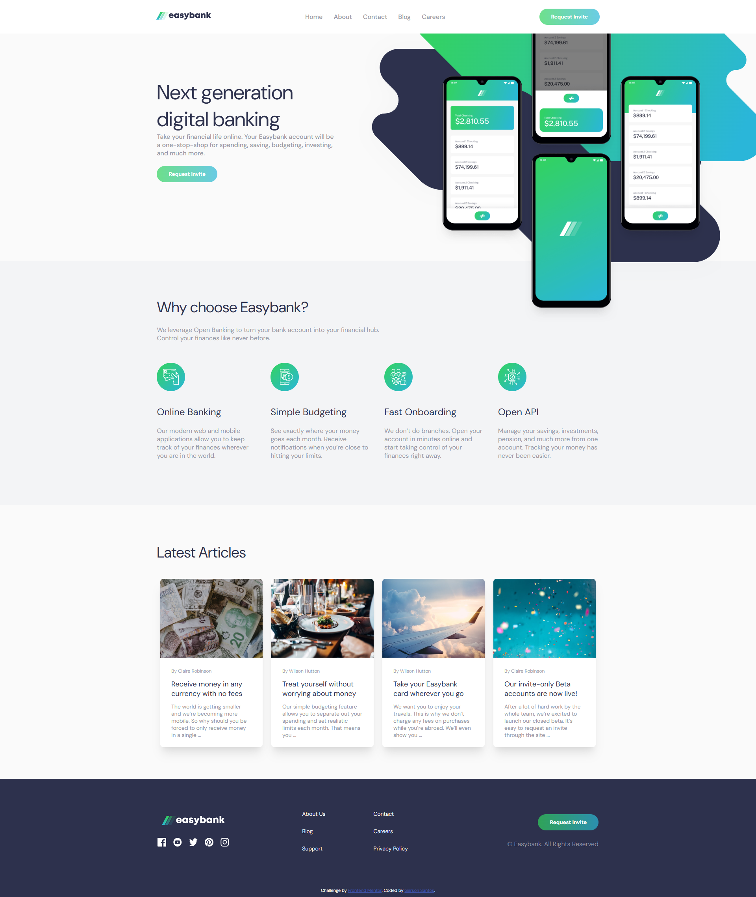

# Frontend Mentor - Easybank landing page solution

This is a solution to the [Easybank landing page challenge on Frontend Mentor](https://www.frontendmentor.io/challenges/easybank-landing-page-WaUhkoDN). Frontend Mentor challenges help you improve your coding skills by building realistic projects. 

## Table of contents

  - [The challenge](#the-challenge)
  - [Screenshot](#screenshot)
  - [Links](#links)
  - [My process](#my-process)
  - [Built with](#built-with)
  - [What I learned](#what-i-learned)
  - [Author](#author)

### The challenge

Users should be able to:

- View the optimal layout for the site depending on their device's screen size
- See hover states for all interactive elements on the page

### Screenshot

### Links

- Solution URL: [Solution URL here](https://github.com/Gerson77/easybank-landing)
- Live Site URL: [Live site URL here](https://easybank-landing-murex.vercel.app/)

## My process

My process has build with more simple possible. Used HTML, CSS e JS.

### Built with

- Semantic HTML5 markup
- CSS custom properties
- Flexbox
- CSS Grid
- Mobile-first workflow

## Author

- Website - [Gerson Santos](https://portifolio-puce-theta-49.vercel.app/)
- Frontend Mentor - [@Gerson77](https://www.frontendmentor.io/profile/Gerson77)
- Linkedin - [Gerson Santos](https://www.linkedin.com/in/gerson-santos-silva/)